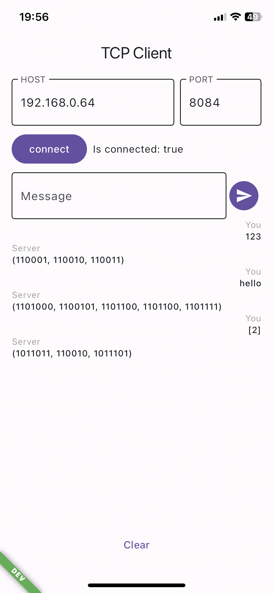
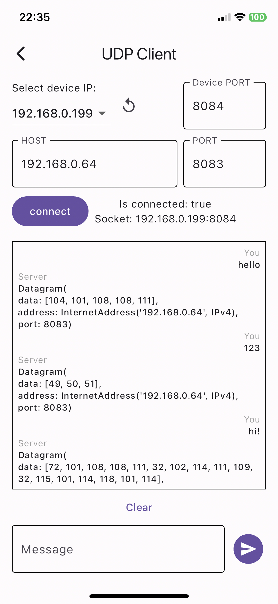

# TCP UDP Flutter app

Flutter application that represents low level communication between server and client via TCP and UDP ways.

## TCP feature

TCP Client page allows to:

* connect specified socket (IP address and port)
* send message to the connected socket
* listen messages from the socket

TCP Client uses `Socket` class from `dart:io`

## UDP feature

UDP Client page allows to:

* specify device socket (IP address and port)
* specify server socket (IP address and port)
* choose device IP from a list of loopback IP addresses
* send message to the connected socket
* listen messages from the socket

UDP Client uses `RawDatagramSocket` class from `dart:io`

## Note

The above images show an example of working with an echo server (written on Dart as well)
